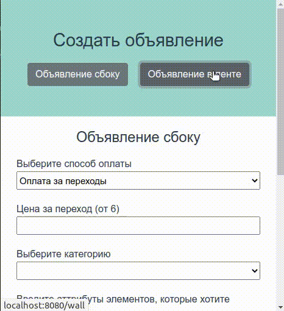

# VK api client

## Инициализация проекта

Открыть командную строку и прописать:
**npm install**

## Сбор данных

Для доступа к api необходимо выполнить следующие шаги:

1. Создать приложение, привязанное к личной странице ВКонтакте и получить его id. [Инструкции](https://vk.com/dev/first_guide?f=2.%20%D0%A0%D0%B5%D0%B3%D0%B8%D1%81%D1%82%D1%80%D0%B0%D1%86%D0%B8%D1%8F%20%D0%BF%D1%80%D0%B8%D0%BB%D0%BE%D0%B6%D0%B5%D0%BD%D0%B8%D1%8F) **Тип приложения можно выбрать либо standalone, либо сайт**

2. Получить access_token. Для этого нужно перейти [сюда](https://oauth.vk.com/authorizeclient_id=APP_ID&display=page&redirect_uri=https://oauth.vk.com/blank.html&scope=ads&response_type=token&v=5.52) и подставить в адресной строке вместо APP_ID id своего приложения

3. Перейти по ссылке и сохранить значение параметра access_token в адресной строке

4. Получить id своей страницы в контакте

5. Получить id [личного кабинета](https://vk.com/ads?act=settings) в контакте

6. Создать группу ВКонтакте и сохранить её id

## Подстановка данных

В каталоге **src/** содержится файл **auth.example.js**. Необходимо переименовать его в **auth.js**.
В файле находится объект *auth_data* с полями, для которых собирались данные и комментарии к ним. Нужно подставить в них нужные значения.

## Запуск проекта

Прописать в командной строке
**npm run serve**

## Инструкции к сайту

Каждое объявление создаётся в два шага:

1. Создаётся [кампания](https://vk.com/dev/ads.createCampaigns)
2. Создаётся [реклама](https://vk.com/dev/ads.createAds)

### Создание бокового рекламного объявления:

#### Создание кампании

При этом типе реклам в параметре **type** нужно указать *normal*
**Пример** запроса может быть (**GET**) таким

<pre>
https://api.vk.com/method/ads.createCampaigns?account_id=ACCOUNT_ID&data=[{
  "client_id":"CLIENT_ID",
  "type":"normal",
  "name":"2 Type",
  "day_limit":"100",
  "all_limit":"1000",
  "start_time":"1725133332",
  "stop_time":"1825133332",
  "status":"0"
}]&access_token=ACCESS_TOKEN&v=5.131
</pre>

В ответе должен прийти **id** только что созданной кампании, он будет использоваться для создания рекламы

#### Создание рекламы

При этом типе реклам в параметре **ad_format** нужно указать *1*
**Пример** запроса может быть (**GET**) таким
<pre>
https://api.vk.com/method/ads.createAds?account_id=ACCOUNT_ID&data=[{
  "campaign_id":"CAMPAIGN_ID",
  "ad_format":"1",
  "cost_type":"0",
  "cpc":"10.00",
  "category1_id":"5",
  "title":"Test For 2 type",
  "link_url":"https://www.youtube.com/watch?v=dQw4w9WgXcQ",
  "name":"Test Add for 1 type",
  "photo":"size:m|server:234321|st2_server:2014|photo_data:eyJrIjp7InNoYSI6ImRmMjY4Yjk1MGI5OGZlMjcwYjAxN2E5NzgwOTE3Y2M2Y2VkYzdlNDI3YmFmOWU4YTcyZGIxOWIxIiwic2VjcmV0IjoiODMyMzI5Mzg0ODU5NzI0NjM5MyIsIndpZHRoIjoxNDUsImhlaWdodCI6MTY1fX0=|width:145|height:165|kid:98fbf805ffe3dbb7dc92363f03810492|hash:67dfba3af0c7ae8bae1451ec6c5ee4b2"
}]&access_token=ACCESS_TOKEN&v=5.131
</pre>
Для того что чтобы загрузить изображение нужно выполнить следующие шаги:

1. Перейти по ссылке (**GET**)
<pre>
https://api.vk.com/method/ads.getUploadURL?ad_format=1&access_token=ACCESS_TOKEN&v=5.131
</pre>
      И получить ссылку для загрузки изображения

2. Отправить изображение на полученную ссылку (**POST**). Запрос должен содержать поле file, которое содержит файл с изображением (JPG, PNG, BMP, TIF или GIF). Максимальный объем файла: 5 Мб. Изображение для этого типа должно быть размерами **145x85**

[Подробне](https://vk.com/dev/upload_photo_ads)

В ответе прийдёт id нового рекламного объявления
Его можно просмотреть в личном кабинете.
### Создание рекламного объявления в ленте:

### Создание кампании

При этом типе реклам в параметре **type** нужно указать *normal*
**Пример** запроса может быть (**GET**) таким

<pre>
https://api.vk.com/method/ads.createCampaigns?account_id=ACCOUNT_ID&data=[{
  "client_id":"CLIENT_ID",
  "type":"promoted_posts",
  "name":"wall ads",
  "day_limit":"100",
  "all_limit":"1000",
  "start_time":"1725133332",
  "stop_time":"1825133332",
  "status":"0"
}]&access_token=ACCESS_TOKEN&v=5.131
</pre>

В ответе должен прийти **id** только что созданной кампании, он будет использоваться для создания рекламы

#### Создание рекламы

Данный тип рекламы использует существующий скрытый пост в группе. Для его создания нужно составить примерно такой запрос
<pre>
https://api.vk.com/method/wall.post?owner_id=-OWNER_ID&message=test&attachments=photo66748_265827614,http://habrahabr.ru&access_token=79f78712644a291e749eccec0fe083e31b271bb3c517e0cd7d5e9eab29a381479333d5ac27831267853fa&v=5.131
</pre>
В поле attachments нужно указывать ссылку на страницу и идентификаторы изображений, видео
К примеру [изображение](https://vk.com/feed?z=photo-145979838_457270137%2Falbum-145979838_00%2Frev) имеет ссылку
<pre>
https://vk.com/feed?z=photo-145979838_457270137%2Falbum-145979838_00%2Frev
</pre>
ID этого изображения будет *photo-145979838_457270137*
ID [видео](https://vk.com/feed?z=video-174061350_456260192%2Ffb6eddc5bc2fcf1e6e%2Fpl_post_-174061350_179182) будет выглядеть так *video-174061350_456260192* (смотреть адресную строку)
При этом, если видео или изображение принадлежит не группе, а одному владельцу, то id будет без минуса после названия его аттрибута

> В данном случае размер изображения/видео не важен
> **Необходимо указать ссылку на сайт в attachments**

При переходе по ссылке возвращается ID скрытого поста. Далее нужно подставить id сообщества и постав в
<pre>

https://vk.com/wall-PUBLIC_ID_POST_ID
</pre>

При этом типе реклам в параметре **ad_format** нужно указать *9*
**Пример** запроса может быть (**GET**) таким
<pre>
https://api.vk.com/method/ads.createAds?account_id=ACCOUNT_ID&data=[{
  "campaign_id":"CAMPAIGN_ID",
  "ad_format":"9",
  "cost_type":"0",
  "cpc":"10.00",
  "category1_id":"5",
  "title":"Test For 2 type",
  "name":"Test Add for 1 type",
  "link_url":"LINK TO STEALTH POST"
}]&access_token=ACCESS_TOKEN&v=5.131
</pre>
В параметр link_url нужно указать ссылку на <a href="#url">скрытый пост</a>

[Подробнее о скрытых постах](https://vk.com/dev/wall.postAdsStealth)

В ответе прийдёт id нового рекламного объявления
Его можно просмотреть в личном кабинете.